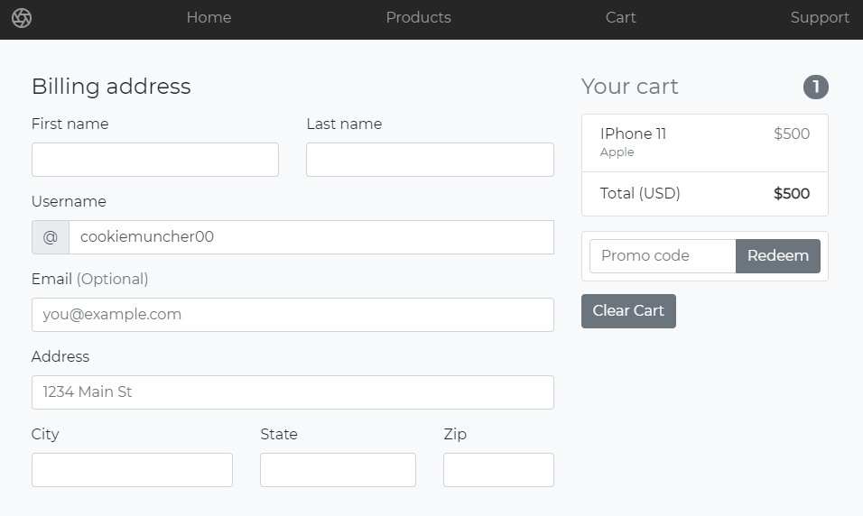

# HuskyTech

## Welcome to HuskyTech
HuskyTech is a mock online store that has a fully fleshed out front-end, api, and back-end. The tech stack includes HTML/CSS/JS, MySQL, and Node.JS (express framework). This project has all the features necessary for an online store for users and for employees. The store is represented in a 3NF relation schema outlined below.

## Homepage
Authentication and authorization helps us set apart users for the main site and employees for the employee portal. If an user does not have an existing account, they can sign up. All user passwords are salted and hashed before added to the database.

## Users
Users can browse merchandise, write and read reviews, create carts and order! Orders and merchandise are pulled and updated in real time, obeying ACID principles.

## Employees
The Employee Portal contains reports for each store location, best-selling devices, devices elligible for discounts, etc. These reports are generated real time from the database.

## Misc.
Our project uses a NodeJS backend using the express framework. The server's main logic is in the /app.js file with the routing logic within the /routes folder. Additionally there is a script/boilerplate code to start the server located in the /bin/www where run configurations like which port to listen on. To run this script, you must make sure you have node installed, this allowed javascript to be run outside the browser. Please download the latest version here: https://nodejs.org/en/ For MariaDB (included with other programs like FileZilla and phpMyAdmin) please download and install XAMPP from https://www.apachefriends.org/index.html.

Steps to install and run the server:
1. Download Node.JS
2. Download and install XAMPP for the MariaDB MySQL RDBMS.
3. Clone/Download this repository
4. Use phpmyadmin or the console UI mysql program (located in the XAMPP/mysql/bin) to create the database.
    - (for phpmyadmin, copy past the ddl and dml files, while for mysql, you must login then use the SOURCE command)
5. After successful database creation and population, in XAMPP start the mysql server.
6. Once inside the HuskyTech/project folder, run the command in the terminal: npm install
    - (this installs all necessary modules to run the server)
7. In the same location, run the terminal command: npm start
8. Open your favorite browser and go to the url of the server (default: http://localhost:3000/)

## Breaking down /app.js and /bin/www

### /app.js
/app.js stores the central logic for the express framework web server. An express object (const app) is created from the npm module import 'express'. The express object then uses middleware functions like app.use(express.json()) parse incoming http requests' bodies. Middleware functions are used to customize your server by providing functionality on incoming http requests and outgoing responses. We some more middleware functions follow in the form of routes. (Line 28: app.use("/login", loginRouter) This line ensures that all requests to http://localhost:3000/login are handled in the Router object returned by the file in /routes/login.js). Finally app.js has more middleware functions to render an error page when an error occurs.

### /bin/www
/bin/www is a Javascript script that builds the http server utilizing the http server module. This script is where the port is set, an event listener for an errors is set, and an event listener for "listening" events. The npm start command just runs the script, it is actually just a simplified naming of the command "node ./bin/www". The node command is the command to run when running javascript outside of the browser. So npm start runs the code to start the server.
